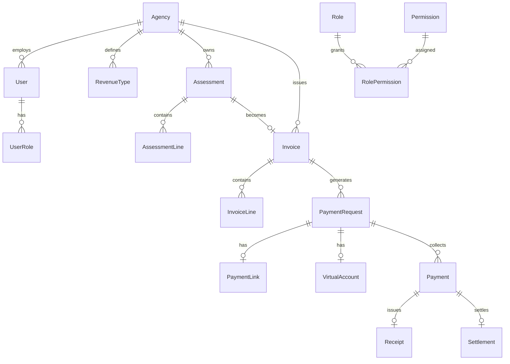

# Entity Relationship Diagram

## Key uniqueness

- `PaymentRequest.paymentCode` globally unique
- `Invoice.invoiceNumber` unique per agency
- `VirtualAccount (accountNumber, bankCode)` unique
- `WebhookEvent (provider, providerEventId)` unique (idempotency)
- `Receipt.receiptNumber` unique per agency
