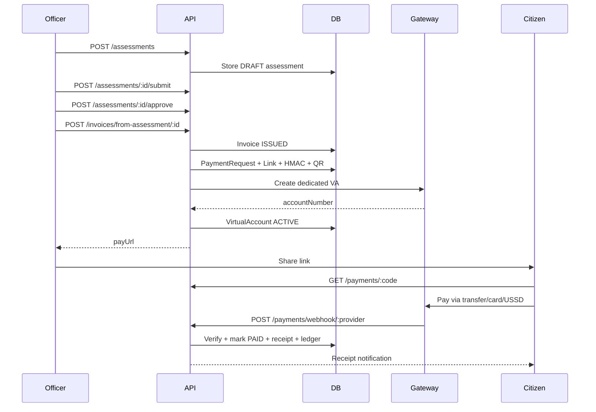
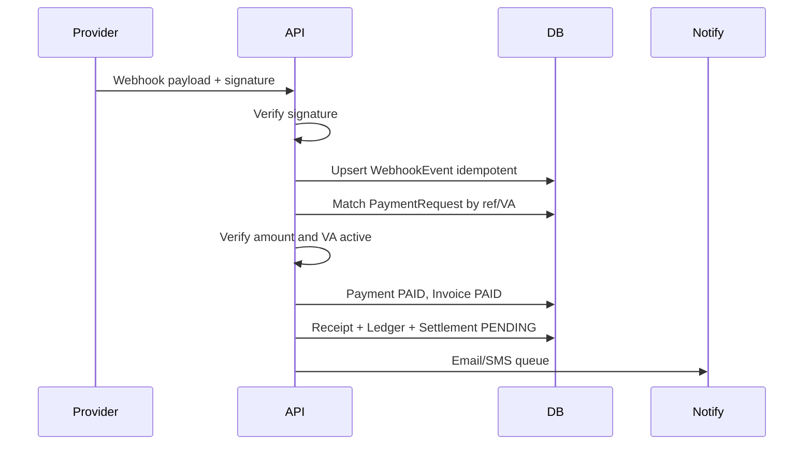

# Sequence Diagrams

## Assessment to payment

```mermaid
sequenceDiagram
  participant Officer
  participant API
  participant DB
  participant Gateway
  participant Citizen

  Officer->>API: POST /assessments
  API->>DB: Store DRAFT assessment
  Officer->>API: POST /assessments/:id/submit
  Officer->>API: POST /assessments/:id/approve
  Officer->>API: POST /invoices/from-assessment/:id
  API->>DB: Invoice ISSUED
  API->>DB: PaymentRequest + Link + HMAC + QR
  API->>Gateway: Create dedicated VA
  Gateway-->>API: accountNumber
  API->>DB: VirtualAccount ACTIVE
  API-->>Officer: payUrl
  Officer->>Citizen: Share link
  Citizen->>API: GET /payments/:code
  Citizen->>Gateway: Pay via transfer/card/USSD
  Gateway->>API: POST /payments/webhook/:provider
  API->>DB: Verify + mark PAID + receipt + ledger
  API-->>Citizen: Receipt notification
```

## Webhook reconciliation

```mermaid
sequenceDiagram
  participant Provider
  participant API
  participant DB
  participant Notify

  Provider->>API: Webhook payload + signature
  API->>API: Verify signature
  API->>DB: Upsert WebhookEvent idempotent
  API->>DB: Match PaymentRequest by ref/VA
  API->>API: Verify amount and VA active
  API->>DB: Payment PAID, Invoice PAID
  API->>DB: Receipt + Ledger + Settlement PENDING
  API->>Notify: Email/SMS queue
```
